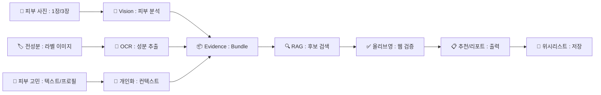
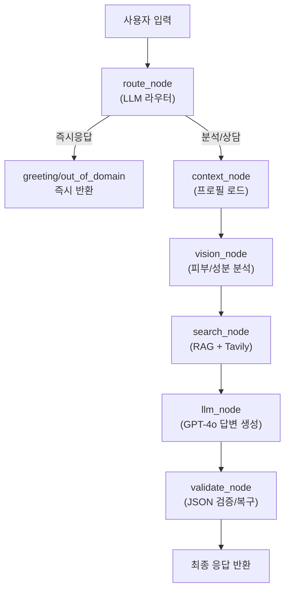

<div align="center">
  <h1>🧴 온유(On_You) :<br />AI 피부 분석 · 성분 OCR · 올리브영 제품 추천 챗봇</h1>
  <div align="center" style="margin: 16px 0 20px 0">
    
  </div>
  <b>AI Skin Analysis & OliveYoung Product Recommendation Chatbot</b>
  <p>딥러닝 피부 정량 분석 · VLM 기반 전성분 OCR · LangGraph 오케스트레이션 · 올리브영 실상품 검증 추천</p>
</div>

---

## 👥 Team. **King Ghidorah** v1.0

<div style="display: flex; align-items: center;">
  
  <b style="font-size: 20px">팀원 소개</b>
</div>
<div align="center">
  <table>
    <colgroup>
      <col style="width: 20%;">
      <col style="width: 20%;">
      <col style="width: 20%;">
      <col style="width: 20%;">
      <col style="width: 20%;">
    </colgroup>
    <tbody>
      <tr>
        <td style="text-align: center;"></td>
        <td style="text-align: center;"></td>
        <td style="text-align: center;"></td>
        <td style="text-align: center;"></td>
        <td style="text-align: center;"></td>
      </tr>
      <tr style="font-weight: bold;">
        <td style="text-align: center;">송민채</td>
        <td style="text-align: center;">정석원</td>
        <td style="text-align: center;">강승원 (팀장)</td>
        <td style="text-align: center;">정유선</td>
        <td style="text-align: center;">이승연</td>
      </tr>
      <tr>
        <td style="text-align: center;">
          <a href="https://github.com/minchaesong"></a>
        </td>
        <td style="text-align: center;">
          <a href="https://github.com/jsrop07"></a>
        </td>
        <td style="text-align: center;">
          <a href="https://github.com/chopa4452"></a>
        </td>
        <td style="text-align: center;">
          <a href="https://github.com/jys96"></a>
        </td>
        <td style="text-align: center;">
          <a href="https://github.com/oooonbbo-wq"></a>
        </td>
      </tr>
    </tbody>
  </table>
</div>

| 이름 | 담당 업무 |
| :-: | :-- |
| 강승원<br />(PM/LLM/BACK) | ResNet50 기반 피부 정량 분석 모델 학습(Fast/Deep), 전성분 추출 모델 학습, LangGraph 파이프라인 설계 및 프롬프트 엔지니어링 |
| 정석원<br />(LLM/BACK) | LLM 응답 생성기 구현 및 LLM 라우터, 올리브영 제품 검증 파이프라인, RAG 기반 답변 보강, FastAPI 백엔드 개발 |
| 정유선<br />(FRONT/BACK) | React 프론트엔드 개발, ChromaDB 벡터 DB 구축 및 관리, RAG 파이프라인 구현, 임베딩 모델(ko-sroberta) 연동, FastAPI 구축 및 백엔드 API 개발 |
| 송민채<br />(BACK/DB) | MySQL 데이터베이스 설계(ERD), 사용자/분석/위시리스트 테이블 구조, FastAPI 백엔드 API 설계 및 개발, 분석 이력 저장 로직 |
| 이승연<br />(AWS/UI) | AWS EC2 서버 배포 및 DB 서버 구축, 서비스 인프라 운영, 로고 및 UI 이미지 디자인 제작 |

---

## 1. 프로젝트 기간

**2025.02.27 ~ 2025.03.03** (5일)

---

## 2. 프로젝트 개요

<div align="center" style="margin: 10px 0 20px 0">
  
</div>

**On You, 오직 당신만을 위한 스킨케어**

On-you(온유)는 화장품에 관심이 많은 20~30대를 대상으로 한 AI 기반 스킨케어 추천 챗봇입니다.

사용자는 대화를 통해 피부 타입·고민·성분·취향을 입력하여 자신에게 적합한 제품을 추천받을 수 있으며 제품의 전성분(성분표) 사진을 촬영/업로드 시, 성분을 추출·분석해 나에게 적합한 성분/주의가 필요한 성분을 안내합니다. 또한 피부 정밀 분석 결과를 통해 현재 피부 상태, 피부 타입, 민감 요인에 맞는 개인 피부관리법을 제공하는 맞춤 스킨케어 서비스입니다.

### 2.1. 프로젝트 배경 및 목적

<div align="center">
  
  <br />
  
  <br />
  
</div>

올리브영은 국내 온라인 뷰티 플랫폼 3사(올리브영·화해·글로우픽) 중에서도 사용자 관심도와 영향력이 가장 높은 플랫폼으로, 화장품 구매와 제품 정보 탐색이 활발하게 이루어지는 대표적인 뷰티 커머스 채널입니다. 이러한 시장 영향력과 사용자 접근성을 고려했을 때, **올리브영 기반의 제품 데이터는 실제 상품 상세 페이지와 연결된 구매 가능 정보를 포함하고 있어, 추천 결과를 실제 구매로 이어지게 할 수 있는 실사용 가치가 높은 데이터**라고 판단했습니다.

현재 CJ올리브영은 매장에서 기기를 통해 피부 상태를 측정하는 체험형 AI 서비스 [스킨스캔(Skin Scan)]을 운영하고 있으며, 진단 결과를 앱에서 조회·관리할 수 있도록 서비스를 고도화하고 있습니다. 그러나 해당 서비스는 매장 방문을 전제로 한 오프라인 중심 서비스로, **시간과 장소의 제약이 있어 사용자가 집에서 즉시 피부 상태를 확인하거나 성분 정보를 분석하고 제품을 추천받기에는 한계**가 있습니다.

이러한 서비스 환경을 바탕으로, **사용자가 스마트폰 앱만으로 언제 어디서나 피부 상태 분석, 성분 분석, 맞춤 제품 추천을 받을 수 있는 홈 기반 스킨케어 챗봇 서비스의 필요성**을 확인하였으며, 이를 기반으로 본 프로젝트를 기획·개발하게 되었습니다.

### 2.2. 프로젝트 목표

본 프로젝트는 **벡터DB 기반 챗봇 상담, 피부 이미지 분석(빠른 분석/정밀 분석), 전성분 OCR 분석을 결합한 멀티모달 스킨케어 AI 챗봇**으로, 사용자의 피부 상태를 분석하고 성분 기반 추천 포인트를 도출하여 올리브영 실상품 검증 기반 제품 추천 및 위시리스트 저장 기능, 피부 이미지 분석 결과를 기반의 피부 관리법 추천까지 제공하는 서비스 개발을 목표로 합니다.



> ⚠️ 본 서비스는 의료 진단/치료가 아닌 **스킨케어 정보 제공** 목적입니다.

---

## 3. 수집된 데이터 및 데이터 전처리

---

### 3.1. 데이터 출처 및 수집 방식

| 데이터 유형 | 출처 및 수집 방식 | 활용 목적 |
| --- | --- | --- |
| 기능성 화장품 보고품목 | 공공 API (기능성화장품 보고품목 정보, 식약처) | 기능성화장품의 제품 목록 및 상세 정보 수집, 성분 안전성 판단 및 피부 교차 필터링 |
| 화장품 원료 성분 정보 | 공공 API (식약처 화장품 원료성분 정보) | 주의 및 제한 성분 조회 |
| 피부 질병 정보 | 대한피부과학회 웹크롤링 (비회원 공개 페이지) | 피부 질환별 상세 정보 수집 및 상담 근거 확보 |
| 피부 관련 리뷰 논문 | PubMed E-utilities API (논문 요약본) | 피부 장벽, 보습, 항노화 관련 최신 학술 근거 제공 |
| 피부 관리 가이드 | AAD(미국피부과학회) 웹 크롤링 | 피부 상태별 관리 단계 및 루틴 구성 |

※ 수집 제외 항목: 학회 회원 전용 콘텐츠, 라이선스 문제 있는 외부 사이트, 과도한 수집 부담 항목

---

### 3.2. 데이터 전처리 파이프라인

#### 3.2.1. 데이터 전처리 과정

- 각 데이터 출처별 문서를 다음과 같이 분류·정리
  - 피부 가이드 (guide) : 피부 고민별 관리, 단계별 관리, 관리 루틴 구성 등
  - 성분 정보 (ingredient) : 성분명, 기능 설명, 피부 타입별 적합성, 성분 간 상호작용, 주의/제한 정보 등
  - 피부 질병 정보 (disease) : 정의, 증상, 원인, 치료, 진단, 합병증 등 상세 항목
  - 기능성화장품 보고품목 (cosmetic_product): 제품명, 효능·효과, 용법·용량, 주의사항, SPF·PA 지수, 방수 여부 등

- 문서 내 청킹 처리: 대용량 문서는 최대 1,000자 단위로 분할하여 RAG(검색 기반 질의응답) 최적화
- 태깅 자동화: 키워드 매칭 방식으로 피부 고민, 성분명, 피부 타입 등 자동 태깅 적용
- 영문 원문은 태깅 후 GPT-4o-mini 모델을 통해 한국어 요약·번역 적용
- 저장 및 검색 최적화:
  - 통일 JSONL 스키마로 정형화 후 ChromaDB에 저장
  - 한국어 특화 임베딩(jhgan/ko-sroberta-multitask) 사용
  - 중복 제거 및 메타데이터 기반 다중 필터링 적용
  - 기능성화장품 보고품목: 염모, 제모, 탈모, 샴푸 등 피부 분석 목적에 맞지 않는 헤어·두피 제품을 키워드 필터링으로 제거
  - 기능성화장품 보고품목: CANCEL_APPROVAL_YN 값이 'Y'인 제품을 제외하여 최신 유효 데이터만

#### 3.2.2. 주요 전처리 시스템 및 스키마

- 통일된 JSONL 스키마

```json
{
  "id": "고유 문서 ID",
  "doc_type": "guide | ingredient | disease | cosmetic_product",
  "category": "대분류 주제",
  "skin_type": ["피부 타입 리스트"],
  "concern_tag": ["피부 고민 키워드"],
  "ingredient_tag": ["주요 성분명"],
  "source": "데이터 출처",
  "chunk_index": "분할 순서",
  "content": "전처리된 텍스트 본문"
}
```

---

### 3.3. 수집 데이터 현황

<div align="center">
  <div style="display: flex; flex-wrap: wrap; gap: 12px;">
    <div>
      <h4 align="center">피부 가이드 (guide)</h4>
      <table>
        <thead>
          <tr>
            <th>카테고리</th>
            <th>상태</th>
          </tr>
        </thead>
        <tbody>
          <tr><td>피부 타입별 관리</td><td>완료</td></tr>
          <tr><td>피부 장벽 관리</td><td>완료</td></tr>
          <tr><td>여드름/트러블 관리</td><td>완료</td></tr>
          <tr><td>미백·색소 관리</td><td>완료</td></tr>
          <tr><td>안티에이징 관리</td><td>완료</td></tr>
          <tr><td>민감 피부 진정 관리</td><td>완료</td></tr>
          <tr><td>모공 관리</td><td>완료</td></tr>
          <tr><td>단계별 관리 (mild→severe)</td><td>완료</td></tr>
          <tr><td>아침/저녁 데일리 루틴</td><td>완료</td></tr>
          <tr><td>주기적 관리 루틴</td><td>완료</td></tr>
          <tr><td>피해야 할 습관</td><td>완료</td></tr>
        </tbody>
      </table>
    </div>
    <div>
      <h4 align="center">성분 정보 (ingredient)</h4>
      <table>
        <thead>
          <tr>
            <th>항목</th>
            <th>상태</th>
          </tr>
        </thead>
        <tbody>
          <tr><td>성분명·기능 설명</td><td>완료</td></tr>
          <tr><td>피부 타입별 적합성 설명</td><td>완료</td></tr>
          <tr><td>성분 간 시너지/충돌 관계</td><td>완료</td></tr>
          <tr><td>농도별 효과 차이 설명</td><td>완료</td></tr>
          <tr><td>주의/제한 성분 여부 및 이유</td><td>완료</td></tr>
          <tr><td>부작용 가능성</td><td>완료</td></tr>
        </tbody>
      </table>
    </div>
    <div>
      <h4 align="center">피부 질병 정보 (disease)</h4>
      <table>
        <thead>
          <tr>
            <th>항목</th>
            <th>상태</th>
          </tr>
        </thead>
        <tbody>
          <tr><td>피부 질병별 상세 설명</td><td>완료</td></tr>
        </tbody>
      </table>
    </div>
    <div>
      <h4 align="center">화장품(제품) 목록 (cosmetic_product)</h4>
      <table>
        <thead>
          <tr>
            <th>항목</th>
            <th>상태</th>
          </tr>
        </thead>
        <tbody>
          <tr><td>기능성 화장품 보고 품목</td><td>완료</td></tr>
        </tbody>
      </table>
    </div>
  </div>

  <h3>태그별 수집 개수</h3>
  
</div>

---

## 4. 기능 및 모델/파이프라인 설계

### 4.1. 핵심 기능 요약

| 기능 | 설명 | 사용 모델/기술 |
| :-: | :-- | :-- |
| 🔬 빠른 분석 | 정면 사진 1장 → 수분/탄력/주름/모공/색소 5개 항목 정량 분석 | ResNet50 (Fast Model) |
| 🔬 정밀 분석 | 정면+좌+우 3장 → 부위별(이마/볼/턱/눈가) 13개 지표 정밀 분석 | ResNet50 + AttentionFusion (Deep Model) |
| 🏷️ 성분 분석 | 화장품 전성분 라벨 사진 → OCR 추출 → 피부타입 맞춤 성분 해석 | Qwen2.5-VL 7B |
| 💬 피부 상담 | 자연어 질문 → RAG 기반 근거 답변 (루틴/성분/고민) | GPT-4o + ChromaDB |
| 🛒 제품 추천 | RAG 후보 → 올리브영 실상품 URL 검증 → 검증된 제품만 추천 | GPT-4o + Tavily |
| 📸 얼굴 검증 | 업로드 이미지가 사람 얼굴인지 + 3장 순서 검증 | GPT-4o-mini (Vision) |
| 🤖 intent 라우팅 | 사용자 입력을 11개 intent로 분류 (비로그인/회원 분기) | GPT-4o-mini |
| 💾 위시리스트 | 추천 제품 저장/조회/삭제 | MySQL/MariaDB |

### 4.2. 피부 분석 모드

#### 4.2.1. Fast Model (빠른 분석)

<ul>
  <li><b>입력</b>: 정면 이미지 1장</li>
  <li><b>모델</b>: 얼굴 영역(area 0~8)별 ResNet50, Sigmoid 출력 (0~1)</li>
  <li><b>출력</b>: moisture(수분), elasticity(탄력), wrinkle(주름), pore(모공), pigmentation(색소) + 각 항목 1~5등급</li>
  <li><b>피부타입 판정</b>: 규칙 기반 알고리즘으로 5가지(건성/지성/복합성/중성/민감성) 확정</li>
  <li><b>속도</b>: ~0.5초</li>
</ul>

**평가 지표**: Validation MAE (0~1 정규화 기준, 낮을수록 정확)

> MAE 0.07 = 예측값이 실제값에서 평균 ±7% 오차 범위 내 (예: 수분 60 → 53~67 예측)

|  Area  |   부위   | Best val_MAE |
| :----: | :------: | :----------: |
| Area 0 | 색소침착 |    0.0615    |
| Area 1 |   이마   |    0.0744    |
| Area 3 |  왼눈가  |    0.0361    |
| Area 4 | 오른눈가 |    0.0343    |
| Area 5 |   왼볼   |    0.0734    |
| Area 6 |  오른볼  |    0.0730    |
| Area 8 |    턱    |    0.0857    |

- **전체 평균 val_MAE**: **0.0626**

<details>
  <summary>반환값 예시 (JSON)</summary>

```json
{
  "mode": "fast",
  "skin_metrics": {
    "moisture": { "value": 0.652, "grade": 4 },
    "elasticity": { "value": 0.621, "grade": 4 },
    "wrinkle": { "value": 0.382, "grade": 2 },
    "pore": { "value": 0.21, "grade": 2 },
    "pigmentation": { "value": 0.272, "grade": 2 }
  }
}
```

- `value`: 0~1 정규화 수치
- `grade`: 1~5등급 (5가 최고)
- 각 항목은 해당 부위 평균값 (수분은 이마+왼볼+오른볼+턱 평균 등)
</details>

#### 4.2.2. Deep Model (정밀 분석)

- **입력**: 정면(F) + 좌측(L) + 우측(R) 3장
- **모델**: area별 ResNet50 + AttentionFusion (3장 가중 융합)
- **출력**: 부위별 13개 측정값 (수분 0~100, 탄력 R2 0~1, 주름 Ra 0~50, 모공 0~2600, 색소 0~350) + 등급 + 신뢰도
- **속도**: ~2초

> Deep Model은 수치(수분, 탄력, 주름Ra 등)와 등급(주름, 모공, 색소 등)을 동시에 예측하므로, 수치 항목은 MAE, 등급 항목은 ±1 정확도로 각각 평가

**Regression 평가 지표**: Validation MAE (0~1 정규화 기준, 낮을수록 정확)

> MAE 0.05 = 예측값이 실제값에서 평균 ±5% 오차 범위 내 (예: 수분 65 → 60~70 예측)

|  Area  |   부위   | Best val_MAE |
| :----: | :------: | :----------: |
| Area 0 | 색소침착 |    0.0904    |
| Area 1 |   이마   |    0.0799    |
| Area 3 |  왼눈가  |    0.1055    |
| Area 4 | 오른눈가 |    0.0826    |

**Classification 평가 지표**: ±1 정확도 (예측 등급이 실제 등급과 1단계 이내일 확률, 높을수록 정확)

> ±1 정확도 90% = 100명 중 90명은 실제 등급 ±1 이내로 예측 (예: 실제 3등급 → 2~4등급으로 예측)

|  Area  |   부위   | ±1 정확도 |
| :----: | :------: | :-------: |
| Area 1 |   이마   |   93.5%   |
| Area 2 |   미간   |   79.4%   |
| Area 3 |  왼눈가  |   90.0%   |
| Area 4 | 오른눈가 |   69.2%   |

<details>
<summary>반환값 예시 (JSON)</summary>

```json
{
  "mode": "deep",
  "measurements": {
    "forehead_moisture": 65.2,
    "l_cheek_moisture": 70.1,
    "r_cheek_moisture": 68.5,
    "chin_moisture": 55.3,
    "forehead_elasticity_R2": 0.621,
    "l_cheek_elasticity_R2": 0.587,
    "r_cheek_elasticity_R2": 0.563,
    "chin_elasticity_R2": 0.41,
    "l_perocular_wrinkle_Ra": 18.5,
    "r_perocular_wrinkle_Ra": 20.1,
    "pigmentation_count": 95.0,
    "l_cheek_pore": 2.0,
    "r_cheek_pore": 2.0
  },
  "grades": {
    "forehead_wrinkle": 1,
    "glabellus_wrinkle": 2,
    "l_perocular_wrinkle": 3,
    "r_perocular_wrinkle": 3,
    "l_cheek_pore": 2,
    "r_cheek_pore": 2,
    "l_cheek_pigmentation": 2,
    "r_cheek_pigmentation": 3,
    "chin_wrinkle": 1,
    "forehead_pigmentation": 1
  },
  "reliability": {
    "forehead_moisture": "medium",
    "forehead_elasticity_R2": "high"
  }
}
```

- `measurements`: 실제 단위로 역정규화된 수치 (수분 0~100, 탄력 0~1, 주름Ra 0~50 등)
- `grades`: 0~6등급 분류 (0=최저)
- `reliability`: 항목별 신뢰도 (high / medium / low / very_low)
</details>

### 4.3. 성분 OCR & 성분 분석

#### 4.3.1. 모델 정보

|    항목     | 내용                                                  |
| :---------: | :---------------------------------------------------- |
| 베이스 모델 | Qwen/Qwen2.5-VL-7B-Instruct                           |
|  모델 유형  | Vision-Language Model (VLM)                           |
|  파라미터   | 7B                                                    |
|   정밀도    | float16 + Flash Attention 2                           |
|    VRAM     | ~15GB _(입력 해상도/visual token budget에 따라 변동)_ |
|  추론 환경  | NVIDIA RTX 5090 (RunPod)                              |
|  라이선스   | Apache-2.0 _(상업적 사용 가능)_                       |

#### 4.3.2. 핵심: OCR이 아닌 VLM 방식

기존 OCR(Tesseract, PaddleOCR)은 "글자를 읽는" 도구에 가깝고, 본 시스템은 이미지의 **맥락과 의미를 이해**하여 전성분만 골라냅니다.  
`[전성분]` 라벨을 시각적으로 인식하고, 마케팅 문구/설명 문장과 성분 목록을 **의미 차원에서 구분**하며, 곡면·그림자·작은 글씨에도 상대적으로 강건합니다.

#### 4.3.3. 왜 VLM이 전성분에 유리한가?

- **레이아웃/문서형 이미지에 강함**: 전성분은 “문서/라벨” 형태로 배치되는 경우가 많아, 문서형 시각 질의응답(DocVQA) 성격에 가까움
- **규칙 기반 후처리 의존도 감소**: “전성분 구간만 추출”을 정규식/좌표 규칙에만 맡기지 않고, 모델이 의미적으로 판별
- **속도-정확도 튜닝 가능**: 입력 해상도(visual token budget)를 제한해 처리시간/VRAM을 조절 가능 _(품질 ↔ 속도 트레이드오프)_

#### 4.3.4. Flash Attention 2 사용 이유 & 주의사항

- **이유**: 긴 컨텍스트·멀티모달 입력에서 메모리/속도 효율 개선
- **주의**: FA2는 일반적으로 `float16/bfloat16` 설정이 필요합니다. dtype 미설정/FP32로 동작하면 경고 또는 성능 저하/오류가 발생할 수 있어, 추론 초기화 시 dtype을 명시합니다.

#### 4.3.5. 성능 비교 (vs 기존 OCR)

|     평가 항목      | Tesseract OCR | PaddleOCR + 후처리 | **본 모델 (VLM)** |
| :----------------: | :-----------: | :----------------: | :---------------: |
|  곡면 텍스트 처리  |       ✗       |         △          |       **✓**       |
| 마케팅 문구 필터링 |       ✗       |   △ (규칙 기반)    | **✓ (의미 이해)** |
|  성분 분리 정확도  |       ✗       |  △ (오분리 발생)   |       **✓**       |
|   평균 처리 속도   |     0.5초     |      0.5~1초       |     **2~5초**     |

#### 4.3.6. 정확도 (3종 테스트 이미지 기반)

|         지표         |   결과   |
| :------------------: | :------: |
| 성분 검출률 (Recall) | **~95%** |
|  정밀도 (Precision)  | **~98%** |
|  마케팅 문구 필터율  | **~99%** |
|   성분 분리 정확도   | **~93%** |

> ⚠️ 3종 테스트 이미지 기반 추정치이며, 이미지 품질(해상도, 조명, 초점)에 따라 달라질 수 있습니다.

#### 4.3.7. 파이프라인 흐름

1. **성분 OCR(VLM)**: 이미지 → 전성분 텍스트/리스트 추출
2. **정규화(Normalization)**: 쉼표/중복/특수문자 제거, INCI 유사 표기 통일(가능한 범위)
3. **성분 매칭/분류**: 사용자 피부타입/고민과 매칭하여
   - 적합 성분 / 주의 성분 / 비추천 성분으로 태깅
4. **LLM 설명 생성**: 성분별 기능/주의사항을 자연어로 요약하여 사용자에게 제공

---

### 4.4. 제품 추천 (올리브영 검증)

#### 4.4.1 개요: “추천”이 아니라 “검증된 추천”

- 단순 웹검색 결과를 그대로 추천하지 않고, **올리브영 상품 상세 URL**로 실재성이 검증된 제품만 추천합니다.
- URL이 확인되지 않은 제품은 **절대 추천하지 않음** _(안전장치/신뢰성 핵심 정책)_

#### 4.4.2. 추천 파이프라인 (3-Stage)

1. **1차 후보 생성: RAG(ChromaDB)**
   - 제품/가이드 문서에서 후보를 검색해 “추천 후보 리스트” 구성
2. **2차 검증: Tavily 웹 검색**
   - 후보 제품명이 실제 올리브영에 존재하는지 웹에서 확인
3. **3차 생성: 검증 통과 제품만 LLM 입력**
   - 검증된 제품(상품 상세 URL 포함)만 근거로 추천 답변 생성

#### 4.4.3. URL 검증 정책(권장 명시)

- **Allowlist**: “올리브영 상품 상세” 패턴만 통과
  - 예: `.../store/goods/getGoodsDetail.do?goodsNo=...`
- **Reject**: 기획전/브랜드관/콘텐츠(매거진/셔터 등) URL은 상품 상세가 아니므로 제외
- **(선택) 2차 실재성 체크**: 후보 URL의 페이지에서 상품명/가격/옵션 등 핵심 요소 존재 여부 확인

#### 4.4.4. Tavily 검색 전략(2단계 운영)

- **정밀 단계(상품 상세 우선)**: `브랜드 + 제품명 + getGoodsDetail` 등으로 상품 상세 URL 우선 확보
- **완화 단계(폴백)**: 상품 상세가 안 잡히면 카테고리/라인 단위로 넓혀 후보를 확보한 뒤, 위 URL 정책으로 재필터링

> 이 2단계 전략을 통해 “기획전 링크만 잔뜩 걸리는 문제”를 구조적으로 완화합니다.

### 4.5. LangGraph 파이프라인



|     노드      | 역할                                                            |
| :-----------: | :-------------------------------------------------------------- |
|  route_node   | GPT-4o-mini로 intent 분류 (11개), 비로그인/회원 분기            |
| context_node  | DB에서 사용자 프로필 로드, 비회원 역질문/회원가입 유도          |
|  vision_node  | Fast/Deep 모델 추론 또는 성분 OCR 실행                          |
|  search_node  | 수치 기반 피부타입 확정 → RAG 쿼리 생성 + Tavily 병렬 실행      |
|   llm_node    | 확정된 피부타입 + 수치 + RAG 결과를 GPT-4o에 전달하여 답변 생성 |
| validate_node | LLM 출력 JSON 스키마 검증 및 자동 복구                          |

---

## 5. 시스템 아키텍처

### 5.1. 전체 아키텍처

<div align="center">
  
</div>

### 5.2. 주요 흐름 (User Flow)

1. 사용자가 로그인 후 채팅창에서 대화 또는 분석 모드 선택
2. **빠른 분석**: 정면 사진 1장 업로드 → GPT Vision 얼굴 검증 → ResNet50 Fast Model 추론 → 피부타입 확정 → LLM 해설
3. **정밀 분석**: 정면/좌/우 3장 업로드 → GPT Vision 얼굴+순서 검증 → Deep Model 추론 → 부위별 13개 지표 + 피부타입 확정 → LLM 해설
4. **성분 분석**: 전성분 라벨 사진 업로드 → OCR 성분 추출 → 사용자 피부타입 맞춤 성분 해석
5. **제품 추천**: RAG 후보 검색 → Tavily 올리브영 검증 → 검증된 제품만 추천
6. **위시리스트**: 추천 제품 저장/조회/삭제

---

## 6. 데이터베이스 설계

ERD 링크: https://www.erdcloud.com/d/2cjZbEpqqK92Mw6AZ

<div align="center">
  
</div>

</div>

### 6.1. 주요 테이블

|    테이블     | 설명                                         |
| :-----------: | :------------------------------------------- |
|     users     | 사용자 정보 (피부타입, 피부고민, 나이, 성별) |
|  chat_rooms   | 채팅방 관리                                  |
| chat_messages | 대화 이력 저장                               |
| skin_analyses | 피부 분석 결과 (피부타입, 점수, 측정값)      |
|   wishlists   | 추천 제품 위시리스트 저장                    |

---

## 7. 디렉토리 구조

```
📦 **SKN23-3rd-3TEAM/**
├── **front/** *(React + Vite 프론트엔드)*
│   ├── index.html                          # 앱 진입점 HTML
│   ├── package.json                        # 의존성 및 스크립트
│   ├── vite.config.ts                      # Vite 빌드 설정 (alias 등)
│   ├── tsconfig.json                       # TypeScript 설정
│   ├── public/
│   │   └── favicon.icons                   # 파비콘 파일
│   └── src/
│       ├── main.tsx                        # React 앱 마운트 진입점
│       ├── vite-env.d.ts                   # Vite 환경변수 타입 정의
│       ├── app/
│       │   ├── App.tsx                     # RouterProvider 루트 컴포넌트
│       │   ├── routes.tsx                  # 전체 라우트 정의
│       │   ├── api/                        # 백엔드 API 호출 함수 모음
│       │   │   ├── authApi.ts              # 로그인·회원가입·이메일 인증·소셜 로그인
│       │   │   ├── chatApi.ts              # 채팅방 CRUD·메시지 전송·게스트 채팅
│       │   │   ├── userApi.ts              # 사용자 프로필 조회·수정·소셜 연동
│       │   │   ├── analysisApi.ts          # 피부 분석 결과 조회
│       │   │   ├── wishlistApi.ts          # 위시리스트 조회·추가·삭제
│       │   │   └── uploadApi.ts            # S3 이미지 업로드
│       │   ├── pages/                      # 라우트에 대응하는 페이지 컴포넌트
│       │   │   ├── ChatPage.tsx            # 메인 채팅 페이지 (비로그인 접근 가능)
│       │   │   ├── AnalysisPage.tsx        # 피부 분석 결과 상세 (로그인 필수)
│       │   │   ├── WishlistPage.tsx        # 위시리스트 목록 (로그인 필수)
│       │   │   ├── WishlistDetailPage.tsx  # 위시리스트 상세 (로그인 필수)
│       │   │   ├── SettingsPage.tsx        # 프로필·계정 설정 (로그인 필수)
│       │   │   ├── LoginPage.tsx           # 로그인
│       │   │   ├── SignupPage.tsx          # 회원가입
│       │   │   ├── ForgotPasswordPage.tsx  # 비밀번호 재설정
│       │   │   ├── OnboardingPage.tsx      # 신규 회원 온보딩(피부정보 입력)
│       │   │   └── OAuthCallbackPage.tsx   # 소셜 로그인 콜백 처리
│       │   └── components/                 # 재사용 가능한 UI 컴포넌트
│       │       ├── Layout.tsx              # 전체 레이아웃(사이드바 + 콘텐츠)
│       │       ├── Sidebar.tsx             # 사이드바(네비·채팅 목록·사용자 정보)
│       │       └── ui/                     # 범용 UI 원자 컴포넌트(shadcn/ui 기반)
│       │           ├── bot.tsx             # 봇 아바타 컴포넌트
│       │           ├── icon.tsx            # SVG 아이콘 래퍼
│       │           ├── loading.tsx         # 로딩 스피너
│       │           ├── use-mobile.ts       # 모바일 감지 훅
│       │           └── utils.ts            # cn() 등 유틸 함수
│       │
│       ├── assets/                         # 정적 리소스(이미지/아이콘/애니메이션)
│       │   ├── logo.png
│       │   ├── profile.png
│       │   ├── info_1.png                  # 빠른/정밀 분석 안내사항 이미지
│       │   ├── info_2.png                  # 성분 분석 안내사항 이미지
│       │   ├── bot.svg
│       │   ├── animations/                 # 애니메이션 WebM 파일
│       │   │   ├── logo_idle_1.webm
│       │   │   ├── logo_loop_1.webm
│       │   │   ├── logo_pop_1.webm
│       │   │   └── logo_text.webm
│       │   ├── icons/                      # 커스텀 아이콘 SVG 파일
│       │   │   ├── beauty.svg
│       │   │   ├── chat.svg
│       │   │   ├── wish.svg
│       │   │   ├── moisture.svg
│       │   │   └── ...
│       │   └── factorial/                  # 피부분석-추천관리법 팩토리얼 SVG 파일 (17종)
│       │       ├── antiaging.svg
│       │       ├── brightening_care.svg
│       │       ├── moisturizing_boost.svg
│       │       └── ...
│       └── styles/                         # 전역 스타일
│           ├── index.css
│           ├── tailwind.css
│           ├── theme.css
│           └── fonts.css
│
├── **back/** *(FastAPI 백엔드)*
│   ├── main.py                             # FastAPI 앱 진입점(CORS, Router 등록)
│   │
│   ├── db/                                 # 데이터베이스 계층
│   │   ├── migrations/                     # 테이블 생성/변경 SQL
│   │   │   └── 001_init_tables.sql
│   │   ├── __init__.py
│   │   ├── db_manager.py                   # DB 연결 및 공통 쿼리 실행(Base layer)
│   │   ├── models.py                       # DB 모델(User, ChatSession 등)
│   │   └── schemas.py                      # Pydantic 스키마
│   │
│   ├── routers/                            # API 엔드포인트(Controller layer)
│   │   ├── __init__.py
│   │   ├── analysis_router.py              # 피부 분석 API
│   │   ├── auth_router.py                  # 인증/토큰 API
│   │   ├── chat_router.py                  # 채팅 API
│   │   ├── deps.py                         # Depends(인증/현재 유저 등)  ※ 파일명 오타 주의
│   │   ├── keyword_router.py               # 키워드 API
│   │   ├── upload_router.py                # S3 업로드 API
│   │   ├── user_router.py                  # 사용자 API
│   │   └── wishlist_router.py              # 위시리스트 API
│   │
│   ├── services/                           # 비즈니스 로직(Service layer)
│   │   ├── __init__.py
│   │   ├── analysis_service.py
│   │   ├── auth_service.py
│   │   ├── chat_service.py
│   │   ├── email_service.py
│   │   ├── keyword_service.py
│   │   └── user_service.py
│   │
│   ├── vector/                             # RAG 벡터 파이프라인(수집 → 전처리 → 임베딩)
│   │   ├── assets/
│   │   │   ├── links/                      # 외부 수집 링크/검색 결과 JSON
│   │   │   │   ├── aad_skin_care_*.json
│   │   │   │   ├── derma_skin_dis_*.json
│   │   │   │   ├── pubmed_search_*.json
│   │   │   │   └── single_search.json
│   │   │   └── vector_data/                # chunk 완료 JSONL(임베딩 입력)
│   │   │       ├── aad_guides.jsonl
│   │   │       ├── derma_disease.jsonl
│   │   │       ├── mfds_ingredient.jsonl
│   │   │       ├── pubmed_skin_guides.jsonl
│   │   │       └── single_item_collection.jsonl
│   │   ├── collectors/                     # 데이터 수집 모듈(RAG 1단계)
│   │   │   ├── aad_data_to_*.py
│   │   │   ├── cosmetic_*.py
│   │   │   ├── derma_data_*.py
│   │   │   ├── mfds_ingredient_*.py
│   │   │   └── pubmed_data_*.py
│   │   ├── utils/
│   │   │   ├── __init__.py
│   │   │   └── tagging.py                  # 메타 태깅/카테고리 로직
│   │   ├── check_collection.py             # Chroma 컬렉션 확인/생성
│   │   └── vectordb_insert.py              # 임베딩 생성 후 Chroma 업로드
│   │
│   ├── ai/                                 # AI 오케스트레이션(LangGraph)
│   │   ├── orchestrator/
│   │   │   ├── graph.py
│   │   │   ├── state.py
│   │   │   ├── router.py
│   │   │   ├── context_builder.py
│   │   │   └── nodes/
│   │   │       ├── route.py
│   │   │       ├── context.py
│   │   │       ├── vision.py
│   │   │       ├── search.py
│   │   │       ├── llm.py
│   │   │       └── validate.py
│   │   ├── llm/
│   │   │   ├── generator.py
│   │   │   └── prompts/
│   │   │       ├── system_base.py
│   │   │       ├── skin_analysis.py
│   │   │       ├── ingredient_chat.py
│   │   │       ├── product_recommend.py
│   │   │       └── general_chat.py
│   │   ├── tools/
│   │   │   ├── rag_retriever.py
│   │   │   └── oliveyoung.py
│   │   └── config/
│   │       └── settings.py
│   │
│   ├── skin_ai/                            # 딥러닝 모델 추론(fast/deep)
│   │   ├── fast_inference.py
│   │   ├── deep_inference.py
│   │   ├── checkpoint/
│   │   │   ├── fast/
│   │   │   └── deep/
│   │   └── ingredient_demo/
│   │       └── demo_products.json
│   │
│   ├── assets/                             # 백엔드 리소스(팀 사진, 데모)
│   │   ├── images/
│   │   └── demo/
│   │
│   └── vector_store/                       # 로컬 Chroma 영속 저장소
│       └── chroma.sqlite3
│
├── README.md
└── requirements.txt
```

---

## 8. Tech Stack

<div align="center">

| Category | Stack |
| :-: | :-- |
| **Front-End** |       |
| **Back-End** |    |
| **인증 / 보안** |      |
| **Database** |  |
| **Vector DB** |  |
| **AI / LLM** |   |
| **ML / DL** |     |
| **RAG / Orchestration** |     |
| **이미지 처리** |   |
| **Infra** |   |
| **Tools** |     |

---

## 9. 실행 방법

### 9.1. Backend (FastAPI)

```bash
  # back 폴더로 이동
  cd ./back
  # venv 생성
  python -m venv skin_venv
  # venv 실행 (Windows)
  skin_venv\Scripts\activate
  # venv 실행 (Mac/Linux)
  source skin_venv/bin/activate
  # 의존성 설치
  pip install -r requirements.txt
  # uvicorn 서버 실행
  uvicorn main:app --reload --port 8000
```

### 9.2. Frontend (React)

```bash
  # nodeJS 18버전 이상 필요
  node --version
  # pnpm 설치
  npm install -g pnpm
  # front 폴더로 이동
  cd ./front
  # 패키지 설치
  pnpm install
  # react 서버 실행
  pnpm dev
```

### 9.3. Environment (.env)

```
# vector DB
DATA_GO_CSMT_KEY
DATA_GO_COSMETIC_KEY
VECTOR_DATA_DIR
CHROMA_DB_PATH
CHROMA_COLLECTION

# mariadb 정보
DB_HOST
DB_PORT
DB_USER
DB_PASSWORD
DB_NAME

# JWT
JWT_SECRET_KEY

# EC2 접속 정보
SSH_HOST
SSH_PORT
SSH_USER
SSH_PKEY

# S3 정보
AWS_REGION=ap-northeast-2
AWS_ACCESS_KEY_ID
AWS_SECRET_ACCESS_KEY
S3_BUCKET_NAME

# API 연결 URL
VITE_API_BASE_URL=http://localhost:8000

# 임베딩 모델
EMBED_MODEL_NAME

# PubMed API
NCBI_API_KEY
PUBMED_EMAIL

# OPEN AI API KEY
OPENAI_API_KEY

# TAVILY_API_KEY
TAVILY_KEY

# VISION MODEL
VISION_MODEL_PATH

# 이메일 인증
SENDGRID_API_KEY
SENDGRID_FROM_EMAIL
EMAIL_OTP_SECRET

# Google OAuth
GOOGLE_CLIENT_ID
GOOGLE_CLIENT_SECRET
GOOGLE_REDIRECT_URI

# Naver OAuth
NAVER_CLIENT_ID
NAVER_CLIENT_SECRET
NAVER_REDIRECT_URI

# 소셜 로그인 콜백 URL
FRONTEND_BASE_URL

```

---

## 10. 화면 설계

### 10.1. 사이트 구조

```bash

On-you(온유)
   ├── chat (회원, 비회원)
   │      ├── 채팅 질문
   │      ├── 빠른 분석
   │      ├── 정밀 분석
   │      └── 성분 분석
   ├── 피부 분석
   │      ├── 현재 분석
   │      └── 비교 분석
   ├── 위시리스트
   ├── 설정
   │      ├── 프로필 (회원정보, 피부정보)
   │      └── 소셜 연동 (구글, 네이버)
   └── 로그인 (일반, 구글, 네이버)
        ├── 비밀번호 찾기 (이메일 인증)
        └── 회원가입 (이메일 인증)

```

### 10.2. 화면흐름도

<div align="center">
  
</div>

### 10.3. 와이어 프레임 (Figma):

https://www.figma.com/make/GidYts0kuhsYalIeB8HraC/Multimodal-Skin-Analysis-Chatbot?t=YhjLgI2srgQIFRuA-1

## 11. 시연화면

  <div align="center">
    
    
    
    
    
    
    
    
    
    
    
    
    
    
  </div>

---

## 12. 트러블 슈팅

### 12.1. 피부타입 분류 편향 (복합성/지성 집중)

- **증상**: 다양한 얼굴 사진을 넣어도 복합성 또는 지성만 출력
- **원인**: ResNet50 Sigmoid 출력이 0.4~0.6 범위에 집중되는데, 판단 임계값이 이를 고려하지 않음
- **해결**:
  1. 모델 출력 분포에 맞춘 상대적 임계값으로 규칙 기반 판정 재설계
  2. 민감성 타입 판정 기준 추가
  3. 규칙 기반으로 확정된 피부타입을 `determined_skin_type`으로 LLM에 전달하여 LLM의 임의 변경 방지
  4. 기본값 "복합성" 제거 → 점수 기반 폴백으로 변경

### 12.2. RAG 검색 0건 문제

- **원인**: 실행 위치(cwd)에 따라 `CHROMA_DB_PATH` 상대경로가 달라져 새 vector_store가 생성
- **해결**: 프로젝트 루트 기준 절대경로 정규화 + `.env`는 루트 기준 상대경로 사용

### 12.3. OCR 모델 CPU 환경 실행 불가

- **원인**: Qwen2.5-VL 7B 모델을 RunPod GPU에서 학습했으나, 실제 서비스 환경은 CPU
- **해결**: 데모용 미리 추출된 전성분 JSON 매칭 테이블 방식으로 대체 (순서 기반 카운터)

### 12.4. LLM 응답에 JSON 구조 노출

- **증상**: 챗봇 답변에 `{"title": "수분 상태", "detail": "..."}` 형태 그대로 노출
- **해결**: 프롬프트에 `chat_answer에는 JSON 형식을 절대 포함하지 않는다` 규칙 및 구체적 예시 추가

---

## 13. 한줄 회고

- **강승원** :이번 프로젝트에서 나는 ResNet50 기반 Fast/Deep 피부 정량분석 파트를 중심으로 모델 학습·개선과 추론 코드 정리, 그리고 MAE/±1 정확도 같은 평가 지표 정리를 맡았습니다. 특히 멀티뷰 정밀 분석 흐름을 다듬고, 눈가·턱처럼 까다로운 부위는 재학습으로 성능을 안정화하는 데 집중했습니다. 각자 맡은 영역을 끝까지 책임져 준 훌륭한 팀원들 덕분에 전체 프로젝트도 무리 없이 잘 마무리할 수 있었습니다.

- **정석원** :이번 프로젝트에서 LLM 단계와 벡터DB(RAG)를 맡으면서, LLM이 의도 분류 → 근거 검색 → 답변 생성 → 검증 흐름으로 동작한다는 걸 확실히 이해하게 됐습니다. 짧은 기간인데도 각자 역할을 끝까지 책임져준 팀원들 덕분에 완성할 수 있었고, 모두 정말 고맙습니다.

- **정유선** :이번 프로젝트에서 ReactJS와 Typescript 기반 프론트엔드와 FastAPI 구축을 처음 경험하며 많은 것을 배웠습니다. 귀여운 이미지 디자인과 디자이너의 도움 덕분에 프론트 개발이 더욱 즐거웠습니다. 또한 한국어 특화 임베딩 모델(jhgan/ko-sroberta-multitask)을 활용한 데이터 수집과 벡터 임베딩 작업도 값진 경험이었습니다. 팀원들 모두가 맡은 바 최선을 다해 주셨고, 팀장님의 훌륭한 리더십 덕분에 프로젝트를 성공적으로 마무리할 수 있었습니다. 모두에게 감사드립니다.

- **송민채** :이번 프로젝트에서 저는 DB 설계, 백엔드 구조 설계, 인증 보안 구현을 맡았습니다. ERD 작성과 외래키 설정을 통해 데이터 관계를 직접 설계하고, 계층 구조로 시스템을 구성하며 이전보다 더 깊이 있게 DB 구조를 고민해볼 수 있었습니다. 또한 프론트엔드, 백엔드, LLM이 동시에 진행되는 개발 과정을 경험하며 여러 영역이 함께 맞물려 돌아간다는 점을 알게 되었습니다. 로그인 비밀번호 암호화와 해싱을 구현하기 위해 보안 내용을 찾아보면서, 이전에는 잘 알지 못했던 개념들을 새롭게 배우는 계기가 되었습니다. 이번 프로젝트를 통해 단순한 기능 구현을 넘어, 전체 흐름과 구조를 고려하며 개발하는 관점을 배우게 되었습니다.

- **이승연** :이번 프로젝트를 통해 로컬 개발 환경에서 EC2 배포와 S3 버킷 생성 및 저장까지 전체 서비스 흐름을 직접 경험할 수 있었습니다. FastAPI 기반 백엔드 개발과 MariaDB 연동을 구현하며 API 구조와 데이터 흐름에 대한 이해를 높일 수 있었습니다. 배포 과정에서 발생한 환경 변수, DB 연결, 서버 설정 오류를 해결하면서 운영 환경에 대한 감각도 한층 성장할 수 있었습니다. 또한 UI 및 인포그래픽 제작과 챗봇 브랜드 디자인에 참여하며 서비스 완성도를 높였고, 웹 서비스 디자인에 대한 이해도 함께 넓힐 수 있었습니다. 부족한 점이 많았음에도 멋진 리더십으로 이끌어주신 팀장님과 따뜻하게 응원해주신 팀원분들께 감사드립니다.
